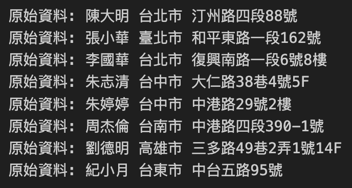
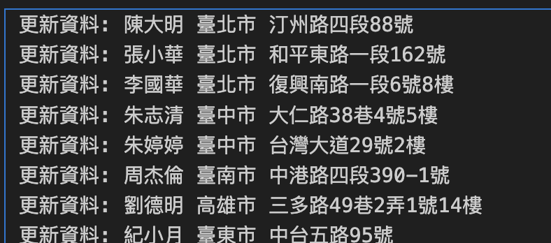

# 地址資料整理Project

- 縣市中，"台"改為"臺"
- 樓層中"F"改為"樓"
- 若住址在台中"中港路"，則把中港路改為"台灣大道"
- 檔案格式為csv

#### 程式流程：開啟輸入檔 -> 讀取輸入檔內容 -> 檢查每一筆資料並修正 ->開啟輸出檔 ->針對每一筆修正資料寫入到檔案

```python
import csv
# open csv存入infile變數 # with：打開檔案後關閉的動作
with open('/Users/tinafung8686/Desktop/GITHUB/Python-Projects/Beginner Projects/Address/地址資料.csv', encoding='cp950') as infile:
    data = list(csv.DictReader(infile))  # 讀取infile檔案，用dict形式
    # 資料變化：csv->list->data變數
    for e in data:

        # 1.處理台->臺
        if '台' in e['縣市']:
            e['縣市'] = e['縣市'].replace('台', '臺')

        # 2.處理F->樓
        if 'F' in e['住址']:
            e['住址'] = e['住址'].replace('F', '樓')

        # 3.處理台中市中港路
        if e['縣市'] == '臺中市' and '中港路' in e['住址']:
            e['住址'] = e['住址'].replace('中港路', '台灣大道')

        print('更新資料:', e['姓名'], e['縣市'], e['住址'])
```
- 原始資料
  


- 更新資料




```python
with open('/Users/tinafung8686/Desktop/GITHUB/Python-Projects/Beginner Projects/Address/新地址資料.csv', 'w', newline='', encoding='cp950') as outfile:
    writer = csv.DictWriter(outfile, fieldnames=data[0].keys())  # data[0]也就是標頭，keys是鍵值
    writer.writeheader()  # 將表頭寫入輸出檔案
    for e in data:
        writer.writerow(e)

# with open('file_name', 'w', newline = '') w是指以寫入模式開啟檔案，若檔案不存在則創建，若存在則覆蓋內容
        # newline = ''是換行處理

```
