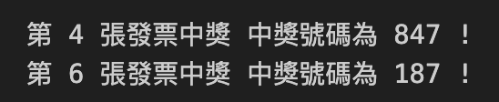
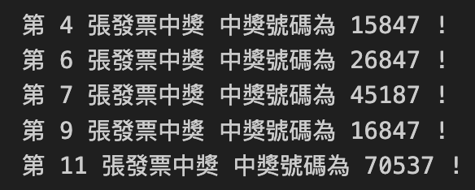

# 發票兌獎Project 1

1. 給定若單發票六獎號碼（末三碼）以及若個需比對的發票號碼（末三碼），用程式去比對幾張發票中獎
2. 中獎號碼和比對號碼為以.txt儲存的純文字檔

```python
# open打開檔案，read()讀取檔案, split()換行分切分
win_num = open(
    '/Users/tinafung8686/Desktop/GITHUB/Python-Projects/Beginner Projects/Invoice Checker/中獎號碼.txt').read().split()
check_num = open(
    '/Users/tinafung8686/Desktop/GITHUB/Python-Projects/Beginner Projects/Invoice Checker/我的發票.txt').read().split()

print(win_num)  # ['250', '847', '739', '537', '675', '187']
print(check_num)  # ['123', '456', '789', '847', '846', '187', '999', '888']

for i, num in enumerate(check_num):  # enumerate->index, element
    if num in win_num:
        print('第', i+1, '張發票中獎。中獎號碼為：', num)

```


# 發票兌獎Project 2
1. 給定若干發票號碼（5碼）以及若干待比對發票
2. 中獎號碼可能是末3, 4, 5碼相符。檔案以txt儲存

```python

win_num_02 = open(
    '/Users/tinafung8686/Desktop/GITHUB/Python-Projects/Beginner Projects/Invoice Checker/中獎號碼-p2.txt').read().split()
check_num_02 = open(
    '/Users/tinafung8686/Desktop/GITHUB/Python-Projects/Beginner Projects/Invoice Checker/我的發票-p2.txt').read().split()

for i, num in enumerate(check_num_02):
    for win_num in win_num_02:
        if num[-5:] == win_num[-5:]:  # 若末5碼相同
            print('第', i+1, '張發票中獎 中獎號碼為', num, '!')
        elif num[-4:] == win_num[-4:]:  # 若末4碼相同
            print('第', i+1, '張發票中獎 中獎號碼為', num, '!')
        elif num[-3:] == win_num[-3:]:  # 若末4碼相同
            print('第', i+1, '張發票中獎 中獎號碼為', num, '!')

```
