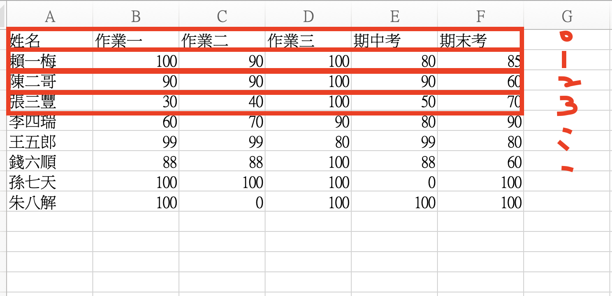

# 成績計算Project

- 原始成績包含三次作業(50%)和一次期中考（20%）一次期末考(30%)。製作一個計算，作業取2次成績最高的，並計算平均值
- 輸入與輸出皆為csv
- 程式邏輯：讀取檔案->處理計算(計算前2高的成績+期中期末)->讀取新檔案（創建）->寫入規則

#### 讀取檔案

- with open(file.csv, encoding = xxx) as infile:
  
  with 為上下文處理器(context manager)，確保檔案在操作後會自動安全的關閉，省略infile.close()

- open(file/csv, mode)：預設模式是'r' (read)，其他還有:
  - 'w' (write)
  - 'a' (append資料尾端新增內容，不覆蓋原內容)

- 處理csv檔案時，避免出現不必要空格，還可以加上：
  - newline = ''

- encoding = 'big5'：big5是中文最常見的編碼格式。若用utf8去讀取中文檔則會出現亂碼

#### csv讀取器

- reader = csv.read(infile): reader根據逗號或其他分隔符號，將每列切分。現在第一列為header, [], [], [],...
- data_rows = list(reader)，現在，每一筆list又被存入一張大的list，變成list of list
  - [['姓名', '作業一', '期中考', ...], ['賴賴', '90', '95', ...], ['陳陳', '70', '80', ...]]

```python
import csv
result = []  # 後續存放成績的空殼
with open('/Users/tinafung8686/Desktop/GITHUB/Python-Projects/Beginner Projects/Midterm Score Calculation/學生成績.csv', encoding='big5') as infile:
    reader = csv.reader(infile)  # 建立一個讀取器，它會按行讀取 CSV 檔案，並將每行轉換為字串列表
    # 將讀取器的所有內容（所有行）轉換成一個名為 data_rows 的列表。data_rows[0] 為標頭，data_rows[1:] 為學生資料。
    data_rows = list(reader) #把解析結果裝入list
```


#### 拆解表格，處理分數

- for sco in data_rows[1:]: score = [int(sco) for sco in sco[1:]]
  - sco是['賴賴', '90', '95', ...], ['陳陳', '70', '80', ...]
  - score = 每一列的所有分數list
  - csv會將所有內容存成純文字檔。若要針對數字計算，需將它改為int
    - score = [int(sco) for sco in sco[1:]] ->語法糖 (suger syntex)
    - #### [運算式 for 元素 in 迭代物件 if 條件]

```python
header = data_rows[0]
    for sco in data_rows[1:]: 
        name = sco[0]
        score = [int(sco) for sco in sco[1:]]
        midterm = score[3]
        final_exam = score[-1]
        score_desc = sorted(score, reverse=True)
        hw_avg = (score_desc[0]+score_desc[1]) * 0.5
        final_score = round(midterm * 0.2 + final_exam * 0.3 + hw_avg * 0.5, 2)
        print(name , score, '作業平均', hw_avg, '總分', final_score) 
        sco.append(final_score) # sco欄位後面加入總分
        result.append(sco) #sco + 總分結果再加入result

```

#### 開新檔案，存入資料

- with open(file_name, 'w', encoding = 'big5')：預設為read mode，因此改為write mode
- header欄位新增一欄為'總成績':header.append()
- 寫入表頭至excel: outfile.write(','.join(header) + '\n')，後面的換行代表學生數據會從下一行開始

```python
with open('/Users/tinafung8686/Desktop/GITHUB/Python-Projects/Beginner Projects/Midterm Score Calculation/學生總成績.csv', 'w', encoding='big5') as outfile:
    header.append('總成績')
    outfile.write(','.join(header) + '\n')
    for stu in result:
        outfile.write(','.join([str(e) for e in stu]) + '\n') #把學生數據存成str後，以逗號分割儲存
```